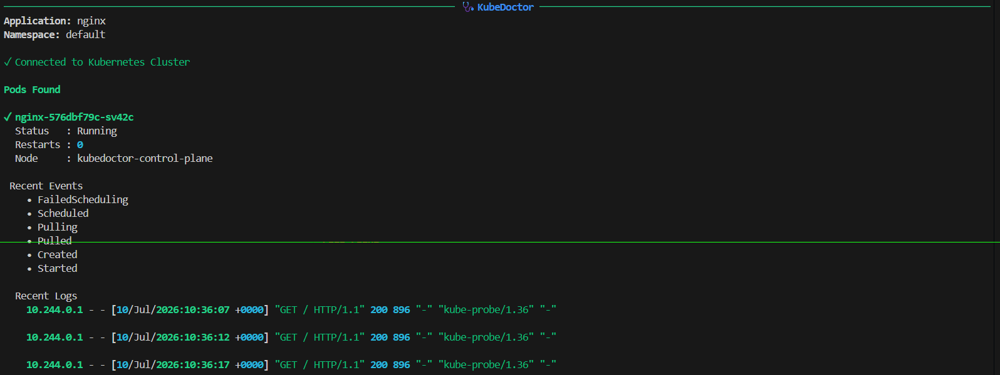
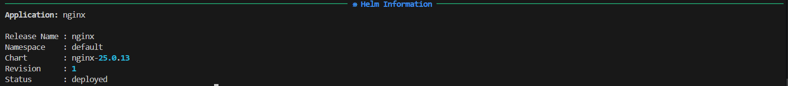

# 🩺 KubeDoctor

KubeDoctor is a lightweight Python-based command-line tool for diagnosing Kubernetes applications. It analyzes pod status, Kubernetes events, container logs, and Helm release information to help identify common deployment issues and provide actionable troubleshooting recommendations.

Built with simplicity in mind, KubeDoctor is designed for developers, DevOps engineers, and Kubernetes learners who want a quick way to inspect application health directly from the terminal.

---

## ✨ Features

- Diagnose Kubernetes applications by deployment name
- Retrieve pod status, restart count, namespace, and node information
- Display recent Kubernetes events
- Fetch recent container logs
- Generate troubleshooting recommendations for common pod failures
- View Helm release information
- Rich terminal output using Rich
- Installable as a Python CLI package
- Docker support
- Automated testing with GitHub Actions

---

## 🛠️ Tech Stack

**Core:**


**DevOps & Tools:**


---

# 📁 Project Structure

```text
KubeDoctor/
├── .github/
│   └── workflows/
│       └── tests.yml
├── kubedoctor/
│   ├── clients/
│   │   ├── helm_client.py
│   │   └── kubernetes.py
│   ├── commands/
│   │   ├── diagnose.py
│   │   └── helm.py
│   ├── core/
│   │   └── recommendations.py
│   ├── cli.py
│   └── __init__.py
├── tests/
├── Dockerfile
├── .dockerignore
├── pyproject.toml
├── requirements.txt
├── requirements-dev.txt
└── README.md
```

---

# ⚙️ Installation

## Clone the repository

```bash
git clone https://github.com/hs2002-18/KubeDoctor.git

cd KubeDoctor
```

## Create a virtual environment

```bash
python -m venv .venv
```

### Linux/macOS

```bash
source .venv/bin/activate
```

### Windows

```powershell
.venv\Scripts\activate
```

## Install the project

```bash
pip install -e .
```

---

# 🚀 Usage

Display available commands

```bash
kubedoctor --help
```

Diagnose an application

```bash
kubedoctor diagnose nginx
```

View Helm release information

```bash
kubedoctor helm nginx
```

Display the application version

```bash
kubedoctor version
```

---

# 📋 Example Output

### Diagnose


---


### Problem Detection

```text
✗ broken-app

Status      : Pending

Recommendations

→ Check the container image name and tag.

→ Inspect container logs for startup failures.
```

---

# 🐳 Docker

Build the Docker image

```bash
docker build -t kubedoctor .
```

Display CLI help

```bash
docker run --rm kubedoctor --help
```

Display the version

```bash
docker run --rm kubedoctor version
```

Diagnose a Kubernetes application

```bash
docker run --rm \
  --network host \
  -v ~/.kube:/root/.kube:ro \
  kubedoctor diagnose nginx
```

> **Note**
>
> When using a local Kind cluster, Docker containers must use `--network host` because the generated kubeconfig points to `127.0.0.1`, which is only reachable from the host machine.

---

# 🧪 Running Tests

Install development dependencies

```bash
pip install -r requirements-dev.txt
```

Run the test suite

```bash
pytest -v
```

---

# 🔄 Continuous Integration

GitHub Actions automatically performs the following on every push and pull request:

- Installs project dependencies
- Runs the complete unit test suite
- Reports build status

Workflow location

```text
.github/workflows/tests.yml
```

---

# 📦 Packaging

KubeDoctor uses **pyproject.toml** for packaging and can be installed as a CLI application.

After installation, the following command is available globally inside the virtual environment:

```bash
kubedoctor
```

---

# 🚧 Future Improvements

Potential enhancements include:

- Namespace filtering
- Resource usage diagnostics
- Service and Ingress health checks
- PVC and Storage diagnostics
- Node health analysis
- Export diagnostic reports as JSON
- Support for multiple Kubernetes contexts

---

# 📄 License

This project is licensed under the MIT License.

---

# 👨‍💻 Author

**Harsh Shrimali**

GitHub: https://github.com/hs2002-18

---

## ⭐ If you found this project useful, consider giving it a star!
